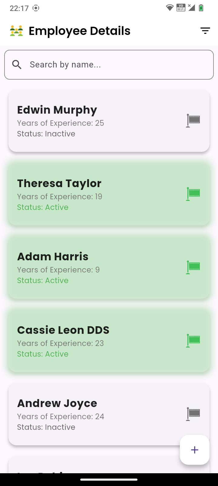
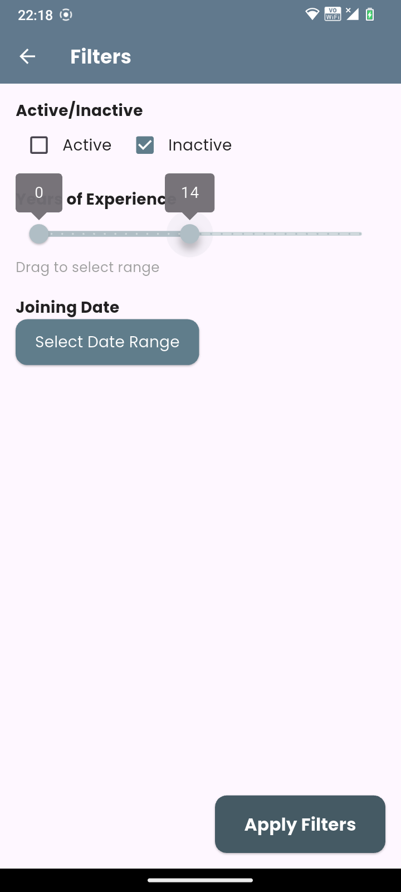
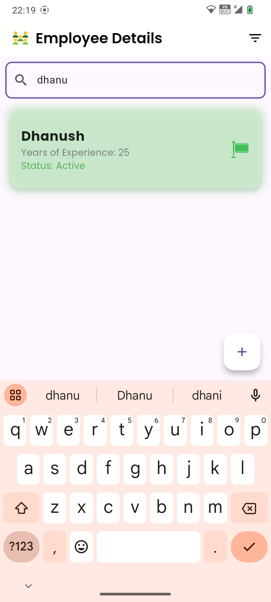
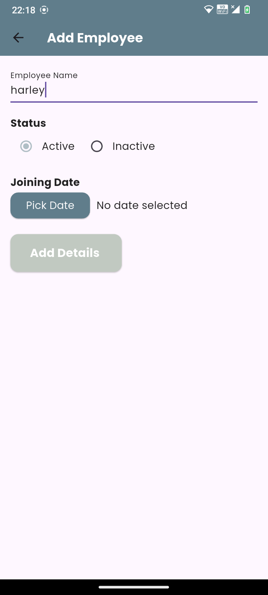
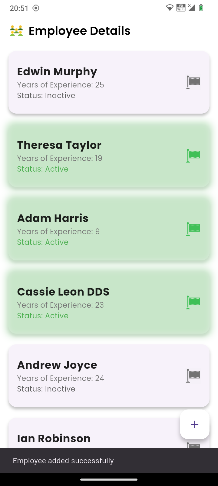
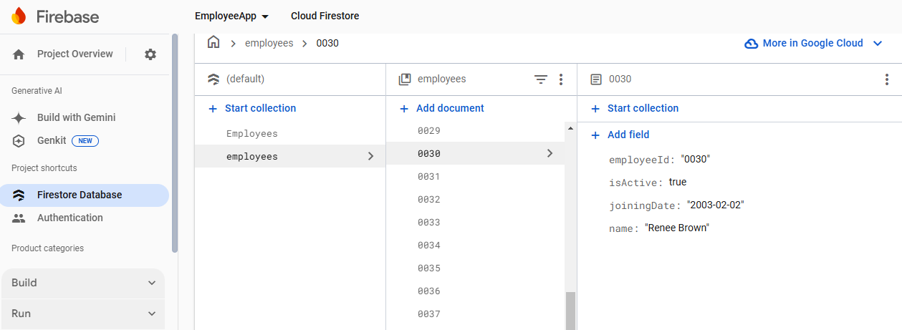

# Employee Management App

An Android app to display employees, flagging those active for 5+ years in green. It also allows adding and filtering employee details. Built with Flutter (frontend), Firebase Firestore (database), and Node.js (backend).

---

## Features
- **View Employee List:** Display all employees stored in Firestore.
- **Highlight Long-term Employees:** Employees active for over 5 years are flagged in green.
- **Add Employees:** Add employee details directly from the app, automatically storing them in Firestore.
- **Search and Filter:** Use filters or search for employees based on criteria like active status or joining date.
- **Interactive UI:** Clean, responsive design optimized for Android.

---

## Technologies Used
- **Frontend:** Flutter
- **Backend:** Node.js
- **Database:** Firebase Firestore

---

## Screenshots

### Home Screen


### Filter Employees


### Search Employees


### Add Employee


### Successfully Added

### Database 

---

## Demo
To see the app in action, watch the demo video:


Firestore Database Structure
Collection: employees
Fields:
employeeId (String): A unique identifier for each employee.
name (String): The name of the employee.
joiningDate (String): The date the employee joined the organization in YYYY-MM-DD format.
isActive (Boolean): Indicates whether the employee is currently active.
Example Document:
json
Copy code
{
  "employeeId": "0030",
  "name": "Renee Brown",
  "joiningDate": "2003-02-02",
  "isActive": true
}
---

## Installation and Setup

### Prerequisites
- Flutter installed ([Install Flutter](https://flutter.dev/docs/get-started/install))
- Node.js installed ([Install Node.js](https://nodejs.org/))
- Firebase project set up ([Firebase Console](https://console.firebase.google.com))

### Steps to Set Up the App
1. **Clone the Repository**
   ```bash
   git clone https://github.com/<your-username>/employee_management_app.git
   cd employee_management_app


